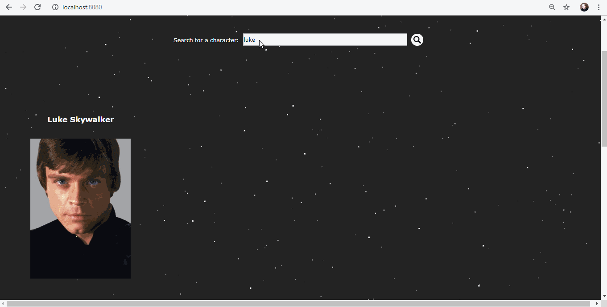
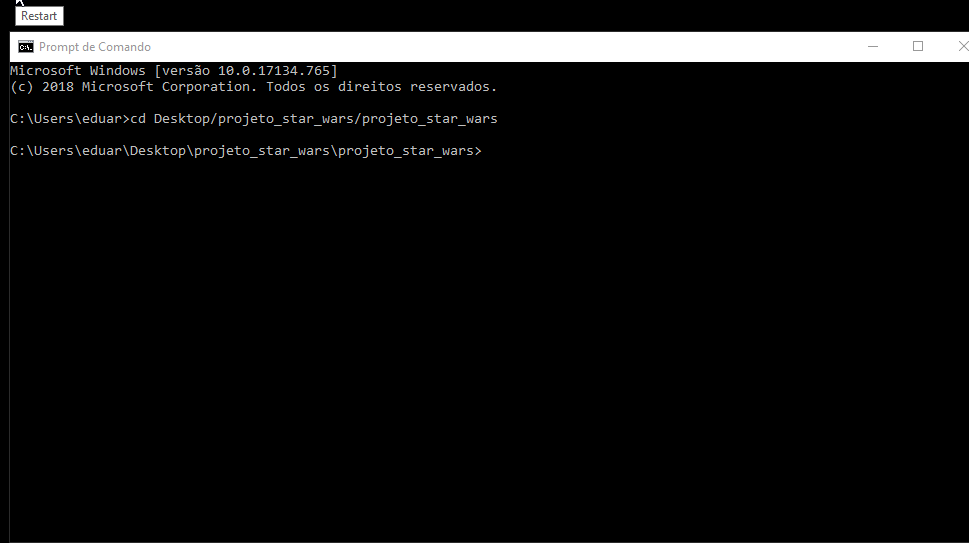

# Star-Wars-Vue-Project
A Vue project consuming an Star Wars API, in two ways: framework and server-side.
---

The main goal was to build an application that returns characters and it's pictures from Star Wars API using Vue framework and Vue from the server.

This project was built in SENAI technical school with the following goals:

- Learn about Vue.js and it's application; 
- Learn about the API consuming and the relation between data startin from it to another web sites;
- Learn with practice the concept of Components and Modules

The following websites were used in the project:

- [Star Wars API](https://swapi.co/ "Star Wars API")

- [Star Wars Visual Guide](https://starwars-visualguide.com/ "Star Wars Visual Guide")

- [DarkCode - 3D Flip Card Effect On Hover Using Only HTML & CSS](
https://www.youtube.com/watch?v=uR7EbQImYmo "CSS Card Effect")

- [WebDev SHORTS - Parallax Pixel Background Animation | HTML & CSS](
https://www.youtube.com/watch?v=aywzn9cf-_U "CSS Stars Background Effect")
---

## Two ways, one goal

Both projects are equal in goals, but made differently. One using a vue file and other using module programming. Both are limited to be used in Chrome browser, due to the stars effect.

### Vue Framework Project

In this folder, there's a few files using a separeted Vue file and applying the concepts using with an external js file with the commands.

### Vue Server Side

To use that, must be created a Vue App, first **installing Node.js** and after **creating the vue app** by vue cli installation. More information can be found in the [Vue Documentation Website](https://vuejs.org/ "Vue Documentation Website") and install Node.js (npm included) in the [Node.js Official Website](https://nodejs.org/en/ "Node.js Official Website")

After created, change the folder name to "src", there's gonna be all the modules needed to perform in the localhost after type the command in the main folder: **npm run serve**.

Version: 1.0

Creation: 06/06/2019

*Everything made with a lot of curiosity and programming passion*
